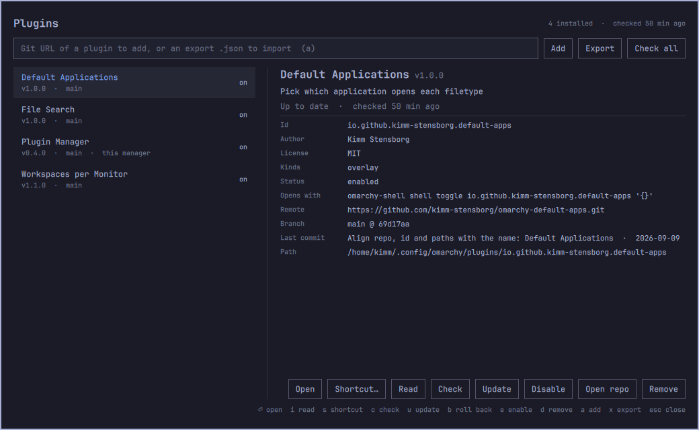

# Plugin Manager

One place to look after the Omarchy shell plugins you installed from git:
list them, read one before you switch it on, see how each opens and open it,
give it a shortcut, see which have updates waiting, review what an update
brings in before installing it, roll an update back, enable, disable, remove,
add new ones from a git URL, and carry the whole set to another Omarchy
install with an export file.



- **Plugin ID:** `io.github.kimm-stensborg.plugin-manager`
- **Kinds:** `overlay`, `bar-widget`
- **License:** MIT
- **Requires:** Omarchy 4 (Quattro) with `omarchy-shell`; `git`, `jq`

It manages **git plugins only**: the checkouts `omarchy plugin add` makes in
`~/.config/omarchy/plugins/`. Everything else is left alone:

- the built-in `omarchy.*` plugins
- clones of built-ins
- folders dropped in by hand
- symlinks to working copies

The manager lists **itself** too, so it can check for, install and roll back
its own updates. It will not switch itself off or remove itself; use
`omarchy plugin remove` for that.

## Install

```bash
omarchy plugin add https://github.com/kimm-stensborg/omarchy-plugin-manager.git
~/.config/omarchy/plugins/io.github.kimm-stensborg.plugin-manager/install.sh
```

`install.sh` gives you three ways in:

- a **shortcut**. It proposes the first free one of `SUPER + ALT + P`,
  `SUPER + CTRL + SHIFT + P`, `SUPER + SHIFT + U` and `SUPER + ALT + U`, and
  you can edit the proposal before accepting it. It lands in
  `~/.config/hypr/bindings.lua`.
- a **menu entry**, *Setup › Plugins › Manage Plugins*, in
  `~/.config/omarchy/extensions/omarchy-menu.jsonc`.
- the **bar button**. Enabling the plugin puts it in the right section. It
  shows a badge with the number of plugins that have an update.

```bash
install.sh --key "SUPER + ALT + P"   # skip the prompt
install.sh --no-bind                 # menu entry and bar button only
install.sh --uninstall               # take the shortcut and menu entry out
```

Or open it directly:

```bash
omarchy-shell shell toggle io.github.kimm-stensborg.plugin-manager '{}'
```

## Keys

| Key | Does |
|-----|------|
| `↑` `↓` / `j` `k`, `Home` `End` | select a plugin |
| `⏎` | open the selected plugin |
| `i` | read it: its files, what can run, its README |
| `s` | give it a shortcut, or change or remove the one it has |
| `m` | put it in the Omarchy menu, or move or remove the entry it has |
| `c` | check the selected plugin for an update |
| `C` | check every plugin |
| `u` | review its update, then install it |
| `b` | roll its last update back |
| `e` | enable or disable it |
| `d` / `Del` | remove it (asks first) |
| `a` / `/` | type a git URL to add, or an export file to import; `⏎` goes, `Esc` leaves the field |
| `x` | export your plugins to a file |
| `o` | open its repository in the browser |
| `r` | reload the list |
| `Esc` | close |

## What it shows

For every plugin:

- name, version, description, author, license and kinds
- whether it is enabled
- its remote, branch, commit and last commit
- **how it opens**: its shortcuts, its entries in the Omarchy menu, and its
  place in the bar
- when it was last updated here, and what a rollback would go back to

Problems are called out: a manifest the validator rejects, local changes that
would stop an update from fast-forwarding, and a checkout that has diverged
from upstream.

## Adding, and reading before you enable

Paste a git URL and press `⏎`. The plugin is cloned and validated by
`omarchy plugin add`, and it lands **disabled**. Plugins run unsandboxed
inside `omarchy-shell`, so the manager then shows it for reading straight
away. You can open this view any time with `i` or **Read**. It shows:

- the kinds the shell will load it as
- every file it ships, with its size
- which of those files are **executable**: those can run outside the shell,
  so they are called out
- its README

**Open folder** closes the manager and opens the plugin in your file manager,
so you can read the code itself. **Enable** switches the plugin on once you
are satisfied.

## Updates

A check does the same fetch as `omarchy plugin update`, so "3 new commits"
means exactly what an update would bring in. The commits are listed, along
with the version the upstream manifest declares.

**The bar button** counts the plugins with an update waiting. It checks at
startup and every six hours after that. When a check finds a plugin that
newly has an update, you get a desktop notification, and clicking it opens
the manager. Each update is announced once, not at every check. A lock keeps
the bar on each monitor from checking at the same time. Opening the manager
also redoes a check that is more than six hours old, and `C` checks again at
any time.

### Reviewing an update

`u` does not update straight away. It fetches, then shows what the update
brings in: the commits, the files it changes with their added and removed
lines, and the diff itself (up to 3000 lines). Nothing changes until you
confirm with `⏎` or **Update**; `Esc` leaves the plugin as it is.

When the manager updates **itself**, the shell restarts afterwards. A running
shell keeps the old version of the manager until it restarts, so that is the
only way the new version loads.

### Rolling an update back

Every update through the manager records the commit and version the plugin
was on. `b` or **Roll back** puts the plugin back there, after asking. The
update you undid then shows as waiting again, to install later or not at all.

A rollback is one step, and it can be used once. It is refused, with the
reason, if:

- the plugin has moved on since that update
- the plugin has local changes, which a rollback would lose
- the old version no longer passes Omarchy's validator

Rolling back the manager itself restarts the shell, like an update does.

The cache in `~/.cache/omarchy/plugin-manager/updates.json` keeps the checks,
the notifications already sent, and what each rollback goes back to.

## Opening a plugin

A shortcut or menu entry belongs to a plugin when its command names the
plugin's id, or runs a script from the plugin's own `bin/` folder.

- **Shortcuts** are read from the `o.bind("KEYS", "Description", "command")`
  lines in `~/.config/hypr/*.lua`. Hyprland cannot say what a binding runs
  with a Lua config, so each one is checked against Hyprland's live bindings
  by keys and description. A shortcut that has been unbound or taken over is
  marked as not active, and one set from the manager is tagged *override*.
  Its description is shown only when it says more than the plugin's name, or
  when the plugin has more than one shortcut.
- **Menu entries** come from the Omarchy menu: the defaults, with your
  `omarchy-menu.jsonc` on top. Each is shown as its path, for example
  *Setup › Plugins › Manage Plugins*.

Two kinds of shortcut are not found: one that runs a script of your own which
then opens the plugin, and one built by Lua code instead of written as a plain
`o.bind` line.

`⏎`, or the **Open** button, closes the manager and opens the plugin with the
command its own shortcut or menu entry runs. When it has neither, Open uses a
plain `omarchy-shell shell toggle <id> '{}'`. A plugin that only runs in the
background has nothing to open, and a disabled one has to be enabled first.

### Giving a plugin a shortcut

`s`, or **Add**/**Change** beside the shortcut in the details, proposes a free
combination made from the plugin's name. It tries the initials first, then the
other letters, each with `SUPER + ALT`, `SUPER + CTRL`, `SUPER + CTRL + SHIFT`
and `SUPER + SHIFT + ALT`. Type over it if you want something else, or press
**Suggestions** for the next free ones made the same way, twelve at most, and
pick one. The dialog checks what you type or pick against Hyprland as you go:
a combination that is free says so, and one that is taken says by what.
Saving a taken one takes it over, unbinding it first.

The shortcut runs the same command as Open, and is written to
`~/.config/hypr/bindings.lua` as a block with its own comment:

```lua
-- Default Applications (io.github.kimm-stensborg.default-apps), bound by Plugin Manager
o.bind("SUPER + ALT + D", "Default Applications", "omarchy-shell shell toggle io.github.kimm-stensborg.default-apps '{}'")
```

Hyprland is reloaded. If it reports a config error, the file is put back as
it was and nothing is kept. The comment is how the manager finds its own
blocks again, so it can move a shortcut or remove it (**Remove shortcut**).
A binding a plugin wrote for itself, under the comment its `install.sh` uses,
`-- Name (<id>)`, is moved and removed the same way. It never edits any other
binding.

### Putting a plugin in the menu

`m`, or **Menu…**, puts an entry for the plugin into the Omarchy menu. It
goes under *Setup › Plugins* unless you pick another place: the top level,
*Apps*, *Setup*, *System* or *Trigger*. The label, description and icon start
out as the plugin's own name, description and the puzzle glyph, and a preview
shows where the entry will appear.

The entry runs the same command as Open. It also gets a short alias, so
`omarchy menu summon <alias>` opens it as well, unless something else already
has that alias. It is written to
`~/.config/omarchy/extensions/omarchy-menu.jsonc` as one line under its own
comment:

```jsonc
// Default Applications (io.github.kimm-stensborg.default-apps), added by Plugin Manager
"setup.plugin.default-apps": {"icon":"󰐱","label":"Default Applications","aliases":["default-apps"],"action":"omarchy-shell shell toggle io.github.kimm-stensborg.default-apps '{}'"},
```

That file is Omarchy's own place for extending the menu, and the menu reloads
it when it changes; the menu Omarchy ships is never touched. Rules the
manager keeps to:

- **It never reuses an id.** In that file, reusing an id overrides the entry
  that has it, Omarchy's own included. So when the natural id is already
  taken, by the defaults, by you or by another plugin, the manager picks the
  next free one.
- **It checks the file before keeping it.** The file is read back as JSONC
  after every change, and put back as it was if it does not read. A missing
  comma on the entry before the new one is added.
- **It only touches entries it looks after.** It can move an entry it wrote,
  or take it out (**Remove entry**). The same goes for an entry a plugin wrote
  for itself under the comment `install.sh` uses, `// ── Name (<id>)`, which is
  how Default Applications adds its own. An entry set from the manager is
  tagged *override*. It never edits an entry anyone else wrote.

## Export and import

`x` writes every plugin to `~/omarchy-plugins-<host>-<date>.json`. Copy that
file to the other machine, install the Plugin Manager there, type the file's
path into the add field and press `⏎`. A preview lists what will be installed
and what is skipped, and nothing happens until you confirm it.

For each plugin the file records:

- its git URL and the commit it was at
- whether it was enabled
- where it sat: its section in the bar and its neighbours, or whether it was
  the bar itself
- its inline settings from `shell.json`

The import clones the **latest** version of each plugin. Plugins that were
enabled are switched on again in the same section, next to the same widget
when the other bar has it, and with the same settings.

A plugin whose remote another machine cannot fetch from is not included, and
the preview says why: one with no remote, or one whose remote is a path on
this disk. The manager itself is not included either, since the other
machine needs it installed to import anything. Plugins that are already
installed are left as they are.

From a terminal:

```bash
bin/plugin-manager export [file]
bin/plugin-manager import <file> --dry-run   # what it would do
bin/plugin-manager import <file>
```

## How it works

| Path | What |
|------|------|
| `Manager.qml` | the overlay: list, details, actions, and the review, read and shortcut dialogs |
| `BarWidget.qml` | the bar button, its update badge and the periodic check |
| `bin/plugin-manager` | the backend; the only code that touches the system |
| `install.sh` | shortcut, menu entry, bar button |
| `test.sh` | backend tests |

The backend prints one JSON document per command: `list`, `check`, `review`,
`inspect`, `update`, `rollback`, `remove`, `add`, `enable`, `disable`,
`suggest-key`, `keycheck`, `bind`, `unbind`, `menu-add`, `menu-remove`,
`export` and `import` (`--help` lists them). The actions wrap the stock
`omarchy-plugin-*` commands, so cloning, validation and rescans work exactly
as they do from the terminal.

Those commands finish by rescanning the shell, and a rescan unloads every open
panel, this one included. So the overlay does not wait on them. It starts
`plugin-manager run …` detached, and that job:

1. writes `running.json` while it works,
2. writes the reply to `last-action.json`,
3. summons the manager back, which shows the result.

The manager is gone for a second or two while the shell rebuilds its panels;
no plugin can stay on screen through that.

Checks, reviews, reads, exports, import previews, shortcut changes and menu
changes do not rescan, so they run directly.

## Remove

```bash
~/.config/omarchy/plugins/io.github.kimm-stensborg.plugin-manager/install.sh --uninstall
omarchy plugin remove io.github.kimm-stensborg.plugin-manager
rm -rf ~/.cache/omarchy/plugin-manager
```

Shortcuts the manager gave to other plugins stay in
`~/.config/hypr/bindings.lua`. Remove them with **Remove shortcut** first, or
delete their blocks by hand.

## Developing

Work in a clone of the repository and bring commits into the installed copy
without going through GitHub:

```bash
git -C ~/.config/omarchy/plugins/io.github.kimm-stensborg.plugin-manager pull ~/Projects/omarchy-plugin-manager main
omarchy restart shell
```

Do not edit the installed copy itself: `omarchy plugin update` refuses to
fast-forward over local changes.

A rescan does not pick up changed QML: the shell keeps the compiled component
cached for as long as the old instance is alive, so after changing
`Manager.qml` or `BarWidget.qml` run `omarchy restart shell`. Errors land in
`/run/user/$UID/quickshell/by-id/*/log.log`. To drive the overlay without
touching the keyboard, `omarchy-shell shell call <id> <function> x` calls any
of its functions, for example `toggleEnabled` or `checkAll`.

## Tests

```bash
./test.sh
```

The tests run the backend against a throwaway `$HOME`, using fake plugins and
local bare repositories as their upstreams. Stand-ins for `omarchy-shell`,
`hyprctl` and `omarchy-notification-send` sit first on `PATH`, so no test
touches your real plugins, `shell.json`, Hyprland config or notifications.
