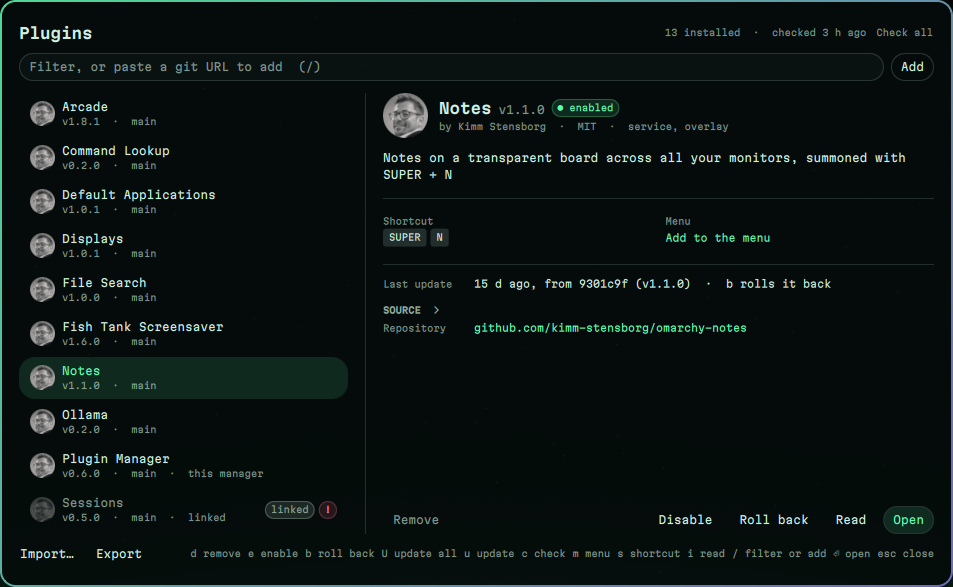
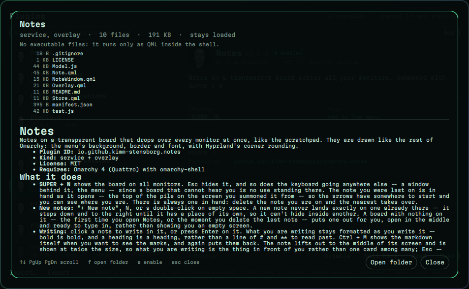
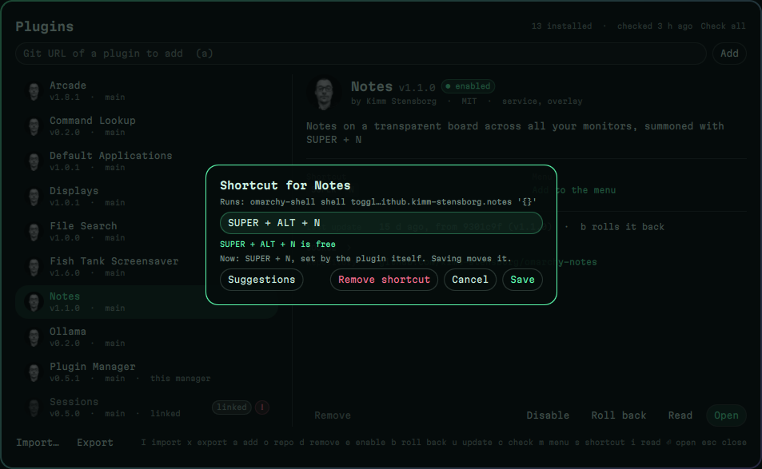

# Plugin Manager

One place for the Omarchy shell plugins you installed from git: add, read,
enable, open, update, roll back, remove — and carry the whole set to another
machine.



- **Requires:** Omarchy 4 (Quattro) with `omarchy-shell`; `git`, `jq`
- **Kinds:** `overlay`, `bar-widget` · **License:** MIT

## Install

```bash
omarchy plugin add https://github.com/kimm-stensborg/omarchy-plugin-manager.git
~/.config/omarchy/plugins/io.github.kimm-stensborg.plugin-manager/install.sh
```

`install.sh` adds a shortcut (the first free of `SUPER + ALT + P` and a few
fallbacks), a menu entry under *Setup › Plugins*, and a bar button that shows
how many updates are waiting. Use `--key "…"` to pick the shortcut,
`--no-bind` to skip it, `--uninstall` to take it all out again.

## What it does

- **Filter and add** — type in the field at the top to filter the list by
  name, id, description or author. Paste a git URL there instead, and the
  plugin is added. It lands disabled and opens for reading first, since
  plugins run unsandboxed inside the shell.
- **Read** — its files and sizes, which ones are executable, and its README.

  

- **Open** — with the command its own shortcut or menu entry runs.
- **Shortcut and menu entry** — give a plugin a free key combination
  (suggestions included, checked live against Hyprland) or an entry in the
  Omarchy menu. Config is checked after writing and put back if it breaks.

  

- **Updates** — checked at startup and every six hours, with a notification
  for each new one. `u` shows the commits and diff before anything changes,
  `U` installs every waiting update after listing them, and `b` rolls the
  last update back.
- **Errors** — anything the running shell logged against a plugin, such as a
  component that failed to compile or an error while it ran, is flagged in
  the list and shown in its details.
- **Export / import** — write every plugin, its enabled state, bar position
  and settings to a `.json` file; import it elsewhere and tick which to
  install.

It only manages **git checkouts** in `~/.config/omarchy/plugins/`. Built-in
`omarchy.*` plugins and folders dropped in by hand are left alone. A plugin
**symlinked** from a working copy is shown greyed out as `linked`: you can
read, toggle and bind it, but not update, roll back or remove it.

## Keys

| Key | | Key | |
|---|---|---|---|
| `↑` `↓` / `j` `k` | select | `c` / `C` | check one / all |
| `⏎` | open | `u` / `U` | update one / all |
| `/` | filter, or add a URL | `b` | roll back |
| `i` | read | `e` | enable / disable |
| `s` | shortcut | `d` | remove |
| `m` | menu entry | `o` | open repository |
| `x` / `I` | export / import | `Esc` | clear filter, close |

## Command line

Everything the overlay does goes through `bin/plugin-manager`, which prints one
JSON document per command (`--help` lists them):

```bash
bin/plugin-manager export [file]
bin/plugin-manager import <file> --dry-run
bin/plugin-manager check --notify
```

## Remove

```bash
~/.config/omarchy/plugins/io.github.kimm-stensborg.plugin-manager/install.sh --uninstall
omarchy plugin remove io.github.kimm-stensborg.plugin-manager
rm -rf ~/.cache/omarchy/plugin-manager
```

Shortcuts it gave other plugins stay in `~/.config/hypr/bindings.lua`; remove
them from the manager first, or by hand.

## Developing

```bash
./test.sh   # backend tests, in a throwaway $HOME with stubbed omarchy-shell and hyprctl
```

A rescan does not reload QML: after changing `Manager.qml` or
`BarWidget.qml`, run `omarchy restart shell`. Errors land in
`/run/user/$UID/quickshell/by-id/*/log.log`.
